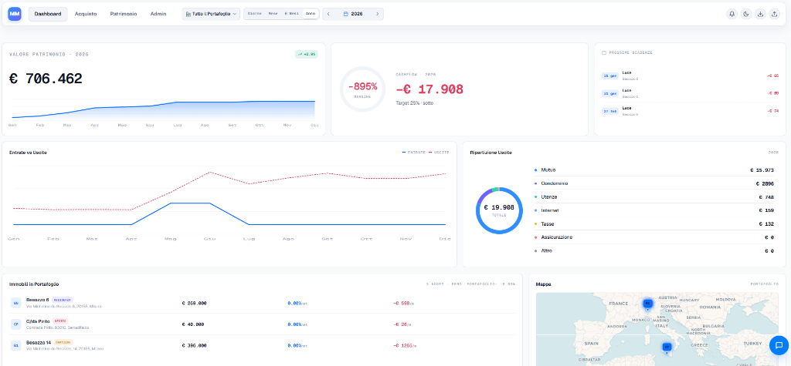

# 🏠 MM's PROPERTY - Real Estate Management AI

**MM's PROPERTY** (v1.4.0) è una piattaforma *all-in-one* ibrida per la gestione avanzata di investimenti immobiliari, ristrutturazioni, locazioni e detrazioni fiscali. Progettata per investitori e property manager, combina strumenti finanziari rigorosi con la potenza dell'Intelligenza Artificiale Generativa (Google Gemini) per offrire analisi strategiche, visualizzazione di design e automazione.

L'applicazione è **cross-platform**: funziona sia come applicazione Desktop nativa (Windows) che come Add-on integrato in Home Assistant.



---

## 🚀 Novità Versione 1.4.0

*   🧾 **Archivio Fatture & Detrazioni Fiscali 730:**
    *   Tracciamento completo di fatture di spesa con data, fornitore, metodo di pagamento (bonifico parlante, ordinario, POS, assegno), codice CRO/TRN e categoria fiscale (*Bonus Casa 50%*, *Bonus 36%*, *Ecobonus 65%*, *Bonus Mobili*, *Detrazione Agenzia 19%*, *Detrazione Notaio Mutuo 19%*).
    *   Gestione quote differenziate tra cointestatari (es. 50% Prima Casa vs 36% Seconda Casa) o percentuali personalizzate (es. 70/30).
    *   Archiviazione e anteprima integrata degli allegati (PDF fattura e ricevuta di pagamento) in base64 nel database locale.
    *   **Calcolo Dinamico Rata Annuale 730:** Selettore interattivo dell'anno di riferimento (1° Anno con quote uniche 19% incluse fino al 10° Anno a regime).
    *   Export completo in formato Excel/CSV per software fiscali italiani (UTF-8 con BOM, separatore `;`).
    *   Backup & Ripristino dedicato JSON dell'intero archivio fatture.

*   📅 **Calendario Scadenze Intelligente Multi-Immobile:**
    *   Generazione automatica e centralizzata di tutte le scadenze: mutui, rate di affitto, spese condominiali, costi ricorrenti, spese di acquisto (caparra, saldo, imposte, notaio, agenzia) e ristrutturazione (SAL lavori, materiali, tecnici).
    *   Filtro dinamico per singolo immobile o vista aggregata di tutto il portafoglio.
    *   Sincronizzazione sensore HA `sensor.immoplan_calendar_deadlines` con eventi in formato JSON per card Lovelace.

*   ⚙️ **Pannello Amministrazione Riprogettato (Bento Grid 12 Colonne):**
    *   **Anagrafica Utenti & Cointestatari Personalizzabile:** Possibilità di modificare i nomi dei due proprietari/beneficiari usati in tutta l'app, con aggiornamento atomico a cascata su scenari, portafogli e fatture nel database.
    *   Navigazione fluida a pillole con scorrimento animato alle sezioni.
    *   Mini-cruscotto KPI dello stato database IndexedDB.
    *   Gestione intuitiva dei sensori personalizzati Home Assistant con prefisso e validazione target.
    *   Danger zone compatta con doppia conferma inline di sicurezza.
    *   Terminale di log di sistema in tempo reale con ricerca rapida e copia negli appunti.

---

## ✨ Funzionalità Principali

### 💰 Gestione Finanziaria e Ristrutturazioni
*   **Business Plan Dettagliato:** Tracciamento granulare di prezzo d'acquisto, spese notarili, agenzia, tasse e saldo finale al rogito.
*   **Gestione Cantiere:** Breakdown dei costi di ristrutturazione (Lavori, Materiali, Tecnici) con monitoraggio SAL (Stato Avanzamento Lavori) e pagamenti (Acconti vs Saldi).
*   **Analisi Mutuo vs Liquidità:** Calcolo automatico del fabbisogno di cassa, LTV (Loan-to-Value) e sostenibilità dell'investimento.
*   **Scenari Multipli:** Possibilità di salvare, esportare e confrontare diverse versioni del progetto (es. "Scenario Ottimistico" vs "Scenario Prudente").

### 🧾 Archivio Fiscale & Detrazioni 730
*   Cruscotto KPI con Spese Archiviate, Base Spesa Ammessa, Credito Fiscale Totale e Rata Annuale ripartita per singolo proprietario.
*   Selettore dinamico degli anni del piano di ammortamento decennale.
*   Archivio documenti con anteprima rapida e guida al bonifico parlante.

### 🤖 AI Powerhouse Chat (Gemini API key richiesta)
*   **AI Advisor Strategico:** Analisi automatica del piano finanziario per individuare rischi e opportunità (modello *Gemini 3 Pro*).
*   **Live Chat:** interagisci tramite chat con tutti i dati caricati ed associati agli immobili

### 📋 Gestione Locazioni e Patrimonio
*   **📈 Storico Valutazioni Reali:** Inserimento di valutazioni storiche reali periodiche (data e valore) per ogni immobile. I grafici dell'andamento patrimoniale integrano i valori effettivi disattivando le stime lineari.
*   **🗂 Layout Anagrafica Ottimizzato:** Struttura a colonne con allegati e storico valutazioni per singolo immobile.
*   **📊 Dashboard Patrimonio Integrata:** Vista globale o filtrata per singolo immobile, con andamento del patrimonio netto reale, cashflow mensile ed entrate vs uscite aggregate in tempo reale.
*   **Registro Affitti:** Tracciamento dettagliato di incassi reali, spese condominiali, tasse, utenze e internet per calcolare il cashflow netto effettivo.
*   **Anagrafica Contatti:** Gestione completa di Inquilini e Locatori con archiviazione dei rispettivi documenti d'identità e contratti.

### 🔌 Integrazione Home Assistant (IoT)
*   **Sensori Virtuali:** Espone automaticamente metriche finanziarie su HA (es. `sensor.immoplan_cashflow_netto`, `sensor.immoplan_valore_asset`).
*   **Calendario Scadenze:** Sensore `calendar_events` che espone la prossima scadenza come stato e la lista completa degli eventi futuri come attributi JSON.
*   **Ingress Ready:** Integrazione nativa nell'interfaccia di Home Assistant senza configurazioni di porta complesse.

---

## 🛠 Specifiche Tecniche

### Architettura Ibrida
Il progetto utilizza un'architettura a codice unico (Monorepo-style) capace di compilare target diversi:
1.  **Desktop (Electron):** Eseguibile `.exe` standalone con backend Node.js integrato.
2.  **Server/Container (Docker):** Immagine ottimizzata per Home Assistant Add-on o deployment cloud.

### Tech Stack
*   **Frontend:** React 19, Vite, CSS personalizzato con supporto per temi Light e Dark/Neon.
*   **UI Components:** Recharts (Grafici), Leaflet (Mappe), Lucide React (Icone).
*   **Backend:** Node.js con Express (gestione API locali e proxy).
*   **Database:** JSON-based persistence (`immoplan_data.json`) con caching locale IndexedDB per performance istantanee.
*   **AI SDK:** Google GenAI SDK (`@google/genai`).

### Modelli AI Utilizzati
L'applicazione sfrutta l'ultima suite di modelli Google:
*   **Reasoning:** `gemini-3-pro-preview` (Analisi finanziaria complessa).
*   **Multimodal/Audio:** `gemini-2.5-flash-native-audio-preview-12-2025` (Consulente Live).
*   **Search/Grounding:** `gemini-2.5-flash` con Tools Google Search & Maps.
*   **Vision/Edit:** `gemini-2.5-flash-image` (Editing foto stanze).
*   **Video:** `veo-3.1-fast-generate-preview` (Generazione video render).

### Struttura Dati
I dati sono salvati localmente per garantire la privacy e la portabilità:
*   **Path (HA/Docker):** `/data/immoplan_data.json` (Volume persistente).
*   **Path (Windows):** `%APPDATA%` o cartella locale dell'eseguibile.
*   **Backup:** Funzionalità di Export/Import completo in formato JSON e CSV.

---

## 🚀 Installazione

### Home Assistant (Add-on)
1.  Aggiungi il repository locale o copia la cartella in `/addons/` o ancora iserisci il link addon https://github.com/peppe492/Add-on_ImmoPlan
2.  Installa l'add-on.
3.  Configura la `api_key` di Google Gemini e il token Home Assistant nella tab **Configurazione**.
4.  Avvia e apri la Web UI.

### Windows (Sviluppo)
```bash
# Installazione dipendenze
npm install

# Avvio in modalità sviluppo (React + Backend)
npm run dev

# Build Eseguibile (.exe)
npm run dist
```
